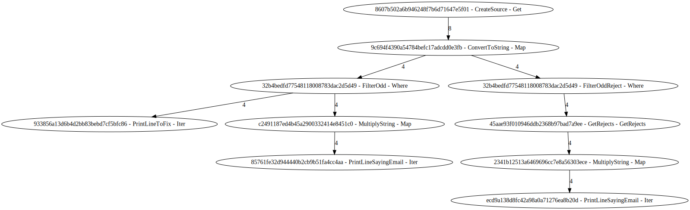

# felt

F# ETL and ELT Library

### **WORK-IN-PROGRESS**

## Example Code

Creates a set of example pipelines, and then outputs the resulting workflow as a [digraph file](https://en.wikipedia.org/wiki/DOT_(graph_description_language)). The edges show numbers to indicate row traffic.

```fsharp
open System
open System.Linq
open felt

let CreateOneExamplePipe jobContext index =
    seq { 0 .. index }
    |> Source.getWithOptions (SourceOptions.CreateDefault(rowLabel = "CreateSource")) jobContext
    |> Source.mapWithOptions (SourceOptions.CreateDefault(rowLabel = "ConvertToString")) (fun row ->
        row.Value.ToString()
    ) |> Source.whereWithOptions (SourceOptions.CreateDefault(rowLabel = "FilterOdd")) (fun row ->
        row.Index % 2 = 0
    )

let PrintFixStuff =
    Source.iterWithOptions (SourceOptions.CreateDefault(rowLabel = "PrintLineToFix")) (fun row ->
        row.Value
        |> printfn "Fix Yo Stuff Yo  %s."
    )

let PrintIfProblem pipeline =
    pipeline
    |> Source.mapWithOptions (SourceOptions.CreateDefault(rowLabel = "MultiplyString")) (fun row ->
        row.Value
        |> Int32.Parse
        |> (*) 2
        |> sprintf "%i"
    )
    |> Source.iterWithOptions (SourceOptions.CreateDefault(rowLabel = "PrintLineSayingEmail")) (fun row ->
        row.Value
        |> printfn "Here's an email  %s."
    )

let LogPipeLineRejects pipeline =
    pipeline
    |> Source.getRejectsWithOptions (SourceOptions.CreateDefault(rowLabel = "GetRejects"))
    |> PrintIfProblem

[<EntryPoint>]
let main argv =
    let jobContext =
        {
            JobContext.CreateDefault()
            with
                Name = "MainJob"
                JobOptions = { JobOptions.Default with EmptyRows = false  }
        }


    let examplePipe1 = CreateOneExamplePipe jobContext 7

    [|  examplePipe1 |> PrintFixStuff
        examplePipe1 |> PrintIfProblem
        examplePipe1 |> LogPipeLineRejects
    |]
    |> Source.evaluate

    printfn ""
    printfn "ID;Label;Count"
    for item in jobContext.Counters do
        printfn "%s;%s;%i" item.Key item.Value.Label item.Value.RowCount

    printfn ""
    printfn "%s" (PrettyPrint.DataFlow jobContext)

    printfn ""
    printfn "%s" (PrettyPrint.Nodes jobContext)

    0 // return an integer exit code
```

**Example digraph render**


